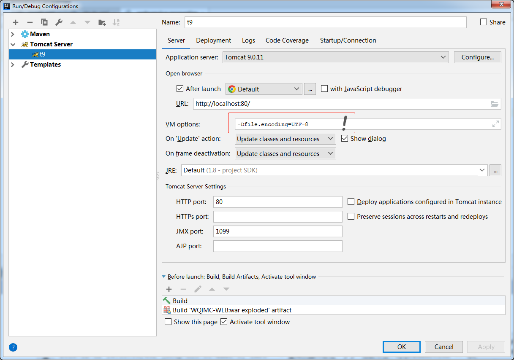
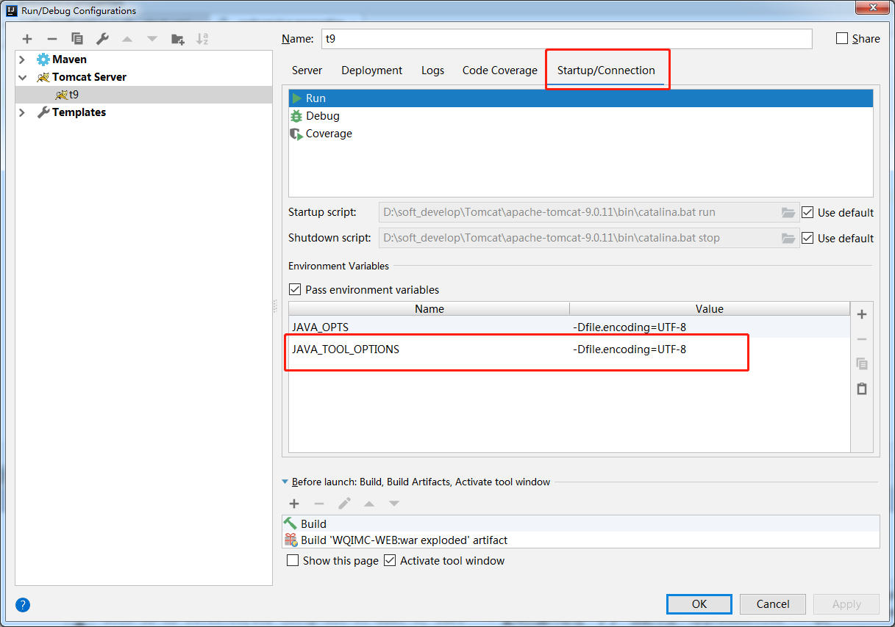

网页出现中文乱码：

相当于直接修改 `Tomcat` 安装目录 /bin 目录下的 `catalina.bat` 文件中添加 `set -Dfile.encoding=UTF-8`

`IDEA` 中还需要在 `startup/connection` 页设置 `JAVA_TOOL_OPTIONS` 为 `-Dfile.encoding=UTF-8`：

 此时，网页上已经没有乱码了，但是控制台还显示乱码，所以还需要修改IDEA的安装目录下：`JetBrains\IntelliJ IDEA 2016.3\bin` 中配置文件 `idea.exe.vmoptions` (或  `idea64.exe.vmoptions` )，

在该文件中最后面加上：`-Dfile.encoding=UTF-8`

然后重启 `IDEA` ，启动所配置的项目即可

tomcat8 之前，默认使用 `ISO-9855-1` 编码 , 可以修改编码方式，否则需要做中文转码处理，tomcat8 之后默认使用 `UTF-8` 编码：

	 <Connector port="80" protocol="HTTP/1.1"
	               connectionTimeout="20000"
	               redirectPort="8443" 
				   URIEncoding="UTF-8"/>